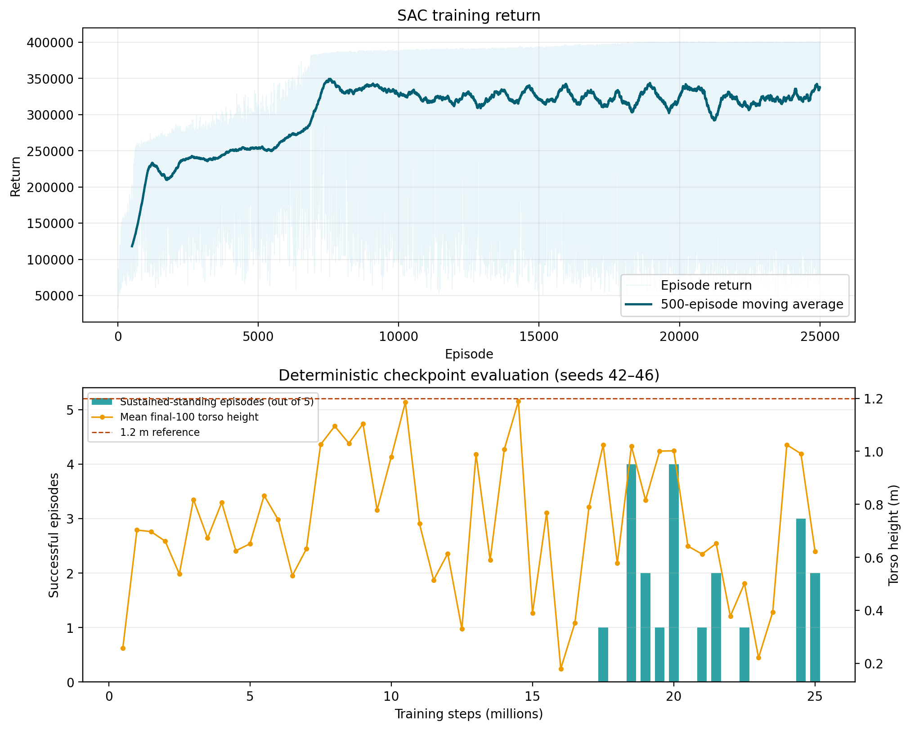

# HumanoidStandup-v5 SAC 实验汇总

> 本文件由 `reproduction/summarize_evaluations.py` 根据确定性评估 JSON 自动生成。

## 当前状态

## 成功视频（先看这里）

<video controls preload="metadata" width="720">
  <source src="artifacts/videos/humanoid_standup_best_18500000_seed43.mp4" type="video/mp4" />
  当前浏览器不支持 HTML5 视频播放。
</video>

- 训练状态：**已完成 25,000,000 步**
- 运行环境：`HumanoidStandup-v5`，GPU：`NVIDIA GeForce RTX 3080 Ti`
- 归档完成标记：`2026-08-21T04:12:41+08:00`
- 已评估检查点：50 个
- 检查点范围：500,000–25,000,000 步
- 每个检查点：5 个确定性回合，种子 42–46
- 持续站立判据：最后 200 步中，躯干高度不低于 1.2 m 的比例至少为 95%
- 排名规则：成功回合数 → 末尾 100 步平均高度 → 平均奖励（字典序降序）

## 当前最佳模型

- 训练步数：**18,500,000**
- 代表性成功回合：**seed=43**（视频中的完整评估回合）
- 代表性回合末 100 步平均躯干高度：**1.223433 m**
- 代表性回合平均奖励：**400100.612**
- 末尾 100 步平均躯干高度：**1.019269 m**
- 平均奖励：**382373.085 ± 35594.953**
- 平均最大躯干高度：**1.249287 m**
- 代表性成功视频已在本报告顶部直接嵌入播放。

奖励不是唯一的选模指标：选模同时检查回合末段的躯干高度，并把代表性成功视频作为最终可视化证据。

## 主要检查点

下表保留排序结果用于复现，但不在主报告中展开稳定回合比例；完整逐回合判据仍保存在 `Results/checkpoint_evaluations_raw/`。

| 排名 | 步数 | 末100步高度/m | 平均奖励 | 奖励标准差 |
|---:|---:|---:|---:|---:|
| 1 | 18,500,000 | 1.019269 | 382373.085 | 35594.953 |
| 2 | 20,000,000 | 1.002089 | 336821.585 | 127741.244 |
| 3 | 24,500,000 | 0.991102 | 334161.885 | 126592.191 |
| 4 | 19,000,000 | 0.815885 | 317188.248 | 112317.792 |
| 5 | 21,500,000 | 0.652605 | 279706.216 | 102525.349 |
| 6 | 25,000,000 | 0.621880 | 220267.848 | 147298.073 |
| 7 | 17,500,000 | 1.024488 | 383221.234 | 27257.588 |
| 8 | 19,500,000 | 1.000902 | 339055.198 | 111488.850 |
| 9 | 21,000,000 | 0.612363 | 222599.262 | 144808.568 |
| 10 | 22,500,000 | 0.501472 | 195368.615 | 115169.791 |

## 可复现文件

- `reproduction/SAC_train_reproduce.py`：训练入口
- `reproduction/evaluate_checkpoint.py`：单模型确定性评估和视频生成
- `reproduction/best_model_monitor.py`：检查点自动评估与 best model 选择
- `reproduction/plot_reproduction_results.py`：由真实训练日志生成汇总图
- `Results/checkpoint_metrics.csv`：全部检查点的聚合指标
- `Results/checkpoint_evaluations_raw/`：逐检查点原始评估 JSON
- `Results/training_rewards.csv`：逐回合训练奖励
- `Results/formal_training_manifest.json`：最终训练环境、版本和超参数
- `artifacts/models/`：保留的候选模型及 SHA-256 校验值
- `artifacts/videos/`：当前最佳模型的成功评估视频与指标

## 解释限制

本实验只有一个训练随机种子（42）。5 个评估种子衡量同一策略对不同初始状态的稳定性，不能替代多训练种子的统计实验。
