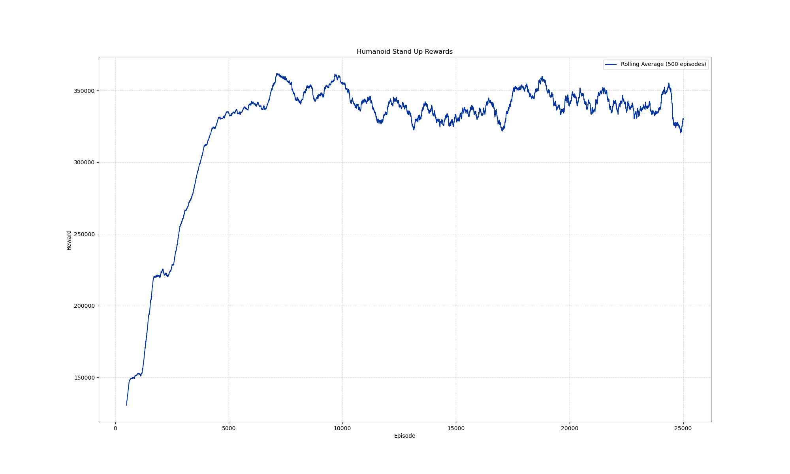

# SACMujoco_HumanoidStandup-v5

## 成功视频（先看这里）

当前最佳模型的代表性成功演示：[`artifacts/videos/humanoid_standup_best_18500000_seed43.mp4`](artifacts/videos/humanoid_standup_best_18500000_seed43.mp4)。

## Overview
This project implements the Soft Actor Critic deep reinforcement learning algorithm from [StableBaselines3](https://stable-baselines3.readthedocs.io/en/master/) on the `HumanoidStandup-v5` environment from MuJoCo via a Gymnasium wrapper. The full details of the environment can be found on the [Gymnasium Humanoid Standup](https://gymnasium.farama.org/environments/mujoco/humanoid_standup/) page.

## Goals
- Successfully run Soft Actor Critic from StableBaselines3 on the Mujoco environment.
- Train the model on an adequate number of timesteps.
- Tune hyperparameters to optimize rewards during training.
- Properly test the trained model.
- Visualize training progress and results.

## System Requirements

The formal run was executed on an AutoDL Ubuntu server with an NVIDIA RTX 3080 Ti. The exact package/GPU snapshot is the checked-in [`Results/formal_training_manifest.json`](Results/formal_training_manifest.json); the commands below are a reproducible installation recipe, not a claim that the repository itself contains a live environment.

- **OS:** Ubuntu 22.04 (remote AutoDL server)
- **Python:** 3.9.21
- **Stable-Baselines3:** 2.4.0
- **PyTorch:** 2.5.1+cu124 (GPU Enabled)
- **Numpy:** 1.26.4
- **Cloudpickle:** 3.1.0
- **Gymnasium:** 1.0.0

## Installation Guide

### Quick installation

For a conda environment, use:

```bash
conda create -n humanoid_sac python=3.9.21 -y
conda activate humanoid_sac
python -m pip install torch==2.5.1 --index-url https://download.pytorch.org/whl/cu124
python -m pip install -r requirements-server.txt
```

Then verify:

```bash
python -c "import torch; print(torch.__version__, torch.cuda.is_available())"
python -c "import gymnasium as gym; e=gym.make('HumanoidStandup-v5'); print(e.observation_space, e.action_space); e.close()"
```

The detailed parameter explanation is in [`docs/SAC参数与复现说明.md`](docs/SAC参数与复现说明.md).

### Manual installation (optional)

The following longer recipe is retained for users who want to provision a plain Ubuntu machine.

### 1. Update System Packages
Ensure your system is up to date before installing dependencies:
```bash
sudo apt update && sudo apt upgrade -y
```

### 2. Install Required System Dependencies
Install Python 3.9 and other essential packages:
```bash
sudo apt install -y python3.9 python3.9-venv python3.9-dev python3-pip git cmake build-essential libopenmpi-dev libomp-dev
```

### 3. Set Python 3.9 as Default (Optional)
If Python 3.9 is not the default version, configure it:
```bash
sudo update-alternatives --install /usr/bin/python3 python3 /usr/bin/python3.9 1
sudo update-alternatives --config python3  # Select Python 3.9 if prompted
```

### 4. Create and Activate a Virtual Environment
It is recommended to install packages inside a virtual environment:
```bash
python3 -m venv rl_env
source rl_env/bin/activate
```

### 5. Upgrade `pip`, `setuptools`, and `wheel`
```bash
pip install --upgrade pip setuptools wheel
```

### 6. Install PyTorch with CUDA Support
Install PyTorch with CUDA 12.4 for GPU acceleration:
```bash
pip install torch torchvision torchaudio --index-url https://download.pytorch.org/whl/cu124
```

### 7. Install Stable-Baselines3
```bash
pip install stable-baselines3==2.4.0
```

### 8. Install Additional Dependencies
```bash
pip install gymnasium==1.0.0 numpy==1.26.4 cloudpickle==3.1.0
```

---

## Notes

- Ensure that your system supports **CUDA 12.4** for GPU acceleration.
- If running inside **WSL2**, make sure **NVIDIA drivers** are correctly installed.

---

## Results
After training on 25 million timesteps (25,000 episodes), the model was able to successfully stand and remain in a standing position for the remainder of the episode.

<p align="center">
 

</p>

The training progress showed rapid improvement in the early episodes and became relatively stable after the first 5,000 episodes.
<p align="center">
 

</p>

---

## Reproduction added for the assessment

This checkout includes a reproducible 25-million-step seed-42 run, periodic
five-seed deterministic evaluation, automatic best-checkpoint selection, and
preserved model artifacts. See the Chinese experiment summary in
[`EXPERIMENT_REPORT.md`](EXPERIMENT_REPORT.md) and the exact execution notes in
[`reproduction/REPRODUCTION_NOTES.md`](reproduction/REPRODUCTION_NOTES.md).

The best checkpoint is selected by sustained-standing success first, rather
than by episode return alone, because a high-return policy can still fall near
the end of an episode.

## Assessment materials

- [`docs/SAC参数与复现说明.md`](docs/SAC参数与复现说明.md)：环境安装、SAC 公式、主要参数和 SPS 解释。
- [`docs/算法对比与改进.md`](docs/算法对比与改进.md)：DQN、Double-DQN、DDPG、TD3、PPO 与 SAC 的区别及改进。
- [`docs/源代码解释.md`](docs/源代码解释.md)：训练、评估、视频和 best model 选择的逐文件说明。
- [`docs/参考资料.md`](docs/参考资料.md)：论文、Gymnasium、CleanRL 和 SB3 的链接及对应关系。
- [`docs/SAC_HumanoidStandup_答辩汇报.pptx`](docs/SAC_HumanoidStandup_答辩汇报.pptx)：中文答辩演示文稿（生成后提交）。

正式实验使用上游代码的 45 维观测切片以保持可复现；默认 Gymnasium 环境仍提供 348 维观测。这个差异和所有训练参数都在参数说明中明确记录。

---

## License

This project is released under the **MIT License**. See [LICENSE](LICENSE) for details.

---

## Acknowledgments

- This implementation builds on **Stable-Baselines3**.
- The environment is based on the work of Tassa, Erez, and Todorov, introduced in ["Synthesis and stabilization of complex behaviors through online trajectory optimization"](https://ieeexplore.ieee.org/document/6386025).
